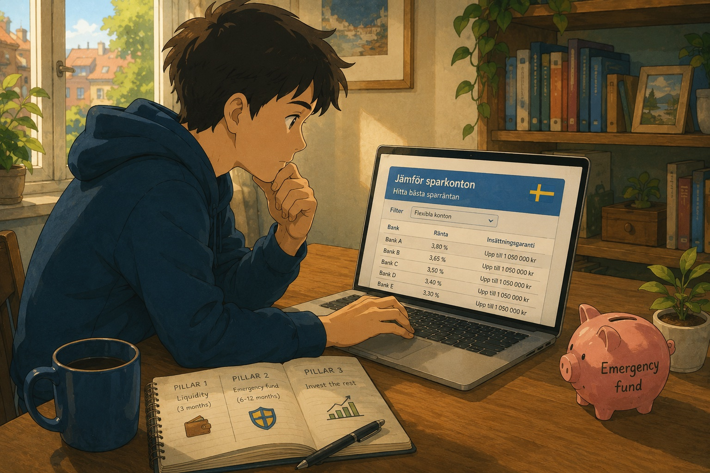

# Investing 101 in Sweden

A simple guide to start managing your finances better in Sweden.

This guide is split in two parts. The first part gives you the simple setup and the decisions that matter most. The second part, **[For the nerds](#for-the-nerds)**, contains the details, caveats, and deeper explanations if you want to understand the mechanics.

## Why invest at all?

Before anything else, there is one fundamental belief you need to accept. Everything in this guide builds on it:

**Over long periods of time, the [global stock market](https://en.wikipedia.org/wiki/Stock_market) goes up.**

Historically, broadly diversified global equity markets have rewarded patient investors over long periods, but not on a predictable schedule. Markets crash, sometimes hard, and there can be long stretches where returns are flat or negative. The point is not that recovery is guaranteed or that it always arrives within exactly 10 years. The point is that if you invest across thousands of companies and give it 10, 20, 30 years, you are betting on global business growth rather than one company, one country, or one lucky trade. The [2008 financial crisis](https://en.wikipedia.org/wiki/Financial_crisis_of_2007%E2%80%932008), the [dot-com bubble](https://en.wikipedia.org/wiki/Dot-com_bubble), COVID-19: every single one was followed by a recovery that surpassed the previous highs.

You don't need to believe that *tomorrow* will be a good day, or that *this year* will be great. You need to believe that *over 10, 20, 30 years*, the world economy will continue to grow. Companies will keep innovating, people will keep consuming, and that growth will be reflected in stock prices.

If you don't believe this, none of the rest matters and you should keep your money in a savings account. But if you do, then *not* investing is the real risk.

### The silent cost of doing nothing: inflation

Money sitting in a bank account feels safe, but it's quietly losing value every year. [Inflation](https://en.wikipedia.org/wiki/Inflation) in Sweden has averaged around 2% historically (and was much higher in 2022-2023). That means:

- 100,000 SEK today will have the purchasing power of roughly 82,000 SEK in 10 years at 2% inflation.
- In 20 years, it's worth about 67,000 SEK in today's money.

A savings account paying 1-2% interest doesn't even keep up with that. Investing in a [global equity fund](https://en.wikipedia.org/wiki/Equity_fund) with historical returns of 7-10% per year doesn't just beat inflation, it [compounds](https://en.wikipedia.org/wiki/Compound_interest) your wealth.

Here's what 5,000 SEK per month looks like at 8% average annual return:

| | 10 years | 20 years | 30 years |
|---|---|---|---|
| You put in | 600,000 SEK | 1,200,000 SEK | 1,800,000 SEK |
| Portfolio value | ~915,000 SEK | ~2,945,000 SEK | ~7,450,000 SEK |
| Investment returns | ~315,000 SEK | ~1,745,000 SEK | ~5,650,000 SEK |

After 20 years, more than half of your portfolio is returns. After 30, it's over 75%. That's compounding: your returns start generating their own returns, and the longer you let it run, the more it snowballs.

Those returns are not free money. They are compensation for taking risk: the market can fall, sometimes for years, and you only get the long-term return if you can stay invested through the bad periods.

### Investing does not have to become a hobby

Many people avoid investing because they think it means picking stocks, reading company reports, watching the market every day, and constantly deciding what to buy or sell. That sounds exhausting, and honestly, it is not what most people should be doing.

This guide is built around the opposite idea: make a few conservative decisions once, automate the monthly flow, and then avoid tinkering. The goal is not to become "good at finance". The goal is to build a system where your money is organized, your emergency fund is separate, and your long-term money goes into broad diversified funds.

The boring version is the feature. Fewer decisions means fewer emotions, fewer mistakes, and fewer chances to do something stupid during a crash. That's why the next step is not to find the perfect stock. It's to organize your money into three simple pillars.

---

## The 3 pillars: organize your money before investing

Before you put a single krona into the stock market, you need to organize your finances into three pillars. Think of them as layers: you build them in order, and you only invest what's left after the first two are solid.

- **Pillar 1: Liquidity.** 1-3 months of predictable expenses in your checking account. Everyday spending money — rent, groceries, bills.
- **Pillar 2: Emergency fund.** 4-8 months of unpredictable expenses in a savings account. Money you never touch unless something goes seriously wrong.
- **Pillar 3: Invest the rest.** Everything left goes into your ISK on Avanza. ~85% global equity fund, ~15% gold.

## Pillar 1: Liquidity

You just want a buffer so you never have to sell investments to pay for lunch.

For banking, I recommend two accounts:

1. A **Swedish bank** where you receive your salary and have [Swish](https://www.swish.nu/) set up. You need this for everyday life in Sweden — Swish is how everyone pays each other here, and your employer will deposit your salary into a Swedish account. I honestly recommend [Nordea](https://www.nordea.se/) - great app, in English and great customer support. You may also consider of having your mortgage there once it's time. 

2. [**Revolut**](https://www.revolut.com/referral/?referral-code=flaviovve%21MAR1-24-AR-LL) for daily spending. This is a referral link. If you ever move out of Sweden, your Revolut account stays with you — all your transaction history, statistics, and cards remain intact, unlike a Swedish bank account you'd close on the way out. It's also the best option for traveling abroad: the exchange rates are close to interbank rates with minimal fees, and the app is genuinely well designed for tracking what you spend. I use it as my primary card for everything except Swish.

One thing: don't use Revolut for investing. They don't offer ISK accounts, so you'd be stuck with worse tax treatment compared to Avanza. Keep Revolut for spending, keep Avanza for investing.

## Pillar 2: The emergency fund

This is money you never touch unless something truly unexpected and unavoidable happens: losing your job, a medical emergency, your car breaking down, an urgent home repair. Planned expenses (vacation, new phone, car service) are not emergencies — budget for those separately.

How much depends on your situation:

- **Single, no kids, stable job:** 4 months is more than enough.
- **Family with dependents:** aim for 8 months.
- **Have good insurance coverage** (hemförsäkring, inkomstförsäkring via your union, etc.)? That lowers the amount you need, as insurance replaces some of the cushion.

Your emergency fund needs to sit in a flexible savings account (sparkonto utan bindningstid), never a fixed-term one. If your money is locked for 12 months, it's not an emergency fund.

Pick the flexible account with the highest interest rate. Most Swedish savings accounts from licensed banks and credit institutions are covered by the [deposit guarantee](https://www.riksgalden.se/var-verksamhet/insattningsgarantin-och-investerarskyddet/sa-fungerar-insattningsgarantin/fragor-och-svar-om-insattningsgarantin/) (insättningsgaranti), which insures your money up to 1,150,000 SEK per person per institution as of 2026. Check that the account is covered, then pick the best rate.

Use this official comparison tool from Konsumenternas (the Swedish consumer finance bureau) to find the current best rate:

**[Jämför sparkonton - Konsumenternas.se](https://www.konsumenternas.se/konsumentstod/jamforelser/sparande--pension/eget-sparande/jamfor-sparkonton---rantor/jamfor-sparkonton/)**

Filter for flexible accounts only. Ignore fixed-term offers, they pay more but defeat the purpose.

## Pillar 3: The investment fund

Before investing, separate long-term money from short-term money. Only invest money you do not need for at least **5-10 years**. If you already know you will need the money soon — moving costs, a car, an apartment down payment, taxes, a wedding, a big trip, a large purchase — keep it in a savings account instead. The stock market is for money that can survive bad timing.

### Why picking stocks is a bad idea

You might be tempted to skip funds and pick individual stocks yourself. A company looks cheap, another one is "obviously" going to grow, and you feel like you can spot a good deal.

The problem is simple: everyone else is looking at the same information. If a company looks like a bargain to you, it probably looks like a bargain to thousands of people who do this full-time.

We are still investing in the stock market, though. The difference is that we are not betting everything on a few companies we think will win. We spread the money across thousands of companies, so one bad company cannot ruin the whole plan.

### Open an ISK on Avanza

[Avanza](https://www.avanza.se) is the recommended broker. It's Sweden's largest investment platform, with zero commission on fund purchases and the ability to set up automatic monthly investments.

When you sign up, open an **[ISK](https://en.wikipedia.org/wiki/Investeringssparkonto)** (Investeringssparkonto). This is the account type designed for passive investing in Sweden. You pay a small flat annual tax on what you hold, Avanza reports everything to Skatteverket automatically, and you never have to deal with tax declarations for your investments. No K4 forms, no tracking of individual buy/sell transactions. You just invest and forget.

One important thing: don't leave uninvested cash sitting in your ISK. The flat tax applies to everything in the account, including cash. If you have money in your ISK that isn't invested, you're paying tax on it for no return. Either invest it or keep it in your regular bank account until you're ready to buy.

### Pick a fund (the 85%)

#### What is a fund?

Buying a single stock is like buying one cherry. If that cherry is rotten, you're out. A [mutual fund](https://en.wikipedia.org/wiki/Mutual_fund) is a basket with hundreds or thousands of cherries. Some will be rotten, some will be great, but the basket as a whole does fine.

In practice, a fund pools money from many investors and uses it to buy many stocks. You buy a share of the fund, and that share represents a tiny slice of everything the fund owns.

#### Why a passive index fund?

Some funds are run by people who try to pick winners. Those are actively managed funds. Other funds just follow a broad list of companies automatically. Those are passive index funds.

For this strategy, you want the boring automatic version: one fund that gives you the world, charges very little, and requires almost no maintenance.

The fund you pick should be:

- **Global.** Not just the US, not just Europe. You want exposure to as many countries and companies as possible, including emerging markets. Nobody knows which region will outperform next decade, so you buy all of them.
- **Cheap.** Fees are boring, but they matter a lot. A high fee quietly eats your return every year.
- **Passive / index-tracking.** The fund should follow a broad list of companies automatically instead of relying on a manager to guess winners.
- **Bought in SEK.** This keeps monthly buying simple and avoids Avanza converting currency on every purchase. More detail in the expert section.

#### Storebrand Global All Countries A SEK

**Link:** [Avanza fund page](https://www.avanza.se/fonder/om-fonden.html/2332/storebrand-global-all-countries-a-sek)

This is the main fund I recommend. It gives you thousands of companies across developed markets and emerging markets in one purchase. That means the US, Europe, Japan, China, India, Brazil, and more.

By buying this one fund, you own a tiny piece of many companies worldwide. No single country, sector, or company can sink you, and you don't need to guess which region will outperform next year.

The annual fee is 0.30%, which is low for a global SEK fund that includes emerging markets.

### Pick your gold (the 15%)

Gold is not there to make you rich. It is there to make the ride less scary.

When stocks crash, gold often holds its value better or goes up. That means your total portfolio drops less, and you panic less. That matters, because the biggest risk to a long-term investor is *selling during a crash*.

In Sweden, there are no normal mutual funds that invest directly in physical gold. So the simplest option on Avanza is a stock-exchange product that tracks physical gold:

**[Invesco Physical Gold ETC](https://www.avanza.se/borshandlade-produkter/certifikat-torg/om-certifikatet.html/1182097/invesco-physical-gold-etc)** (ticker: SGLD, ISIN: IE00B579F325) — 0.12% annual fee, physically backed by gold bars in vaults.

You cannot put this in Avanza's automatic monthly fund purchase flow, so buy it manually once in a while and keep it around the ~15% target.

### Set up monthly investing

Once your ISK is open and you've picked your fund, the last step is to automate everything so you never have to think about it.

#### How much to invest

In theory, your investable amount each month is your salary minus your expenses. In practice, you might not want to invest all of that. Pick a percentage you're comfortable with and that still leaves room for planned expenses (travel, bigger purchases, etc.). Even a smaller amount invested consistently is better than a larger amount invested sporadically.

#### Set up månadssparande

Go to [Avanza's månadssparande page](https://www.avanza.se/manadssparande.html) and set up a monthly auto-invest. You pick which fund(s), how much goes into each, and the day of the month. Avanza handles the auto-giro from your bank automatically as part of the same setup.

Once it's running, money flows from your bank to your ISK to your fund every month without you doing anything. The only manual step is buying the gold ETC, since ETCs cannot be part of månadssparande.

This approach is called **[dollar-cost averaging](https://en.wikipedia.org/wiki/Dollar_cost_averaging)**: by investing the same amount at regular intervals, you buy more shares when prices are low and fewer when prices are high. Over time, this smooths out volatility and removes the temptation to time the market. The most important thing is consistency.

## What to do during a crash

At some point, the market will drop 20%, 30%, maybe more. Your portfolio will be deep in the red and every headline will tell you it's going to get worse. This is normal. It has happened before and it will happen again.

The most important thing you can do is **nothing**. Keep your månadssparande running, don't sell, and don't look at your portfolio every day. The entire strategy in this guide is built on the assumption that the market recovers over time, and historically it always has.

If you have extra money set aside, a crash is actually a great opportunity to buy more. Everything is on sale. But don't try to time the bottom, because you won't. And don't keep money on the side *waiting* for the next crash either, because the next crash could come after the market has already doubled from here. You'd be sitting on cash losing value to inflation while waiting for a dip that might not come for years.

The best approach is boring: invest consistently every month regardless of what the market is doing. Your dollar-cost averaging setup handles this automatically. The people who lose money in the stock market are the ones who panic sell at the bottom and buy back in after the recovery.

## Don't forget your pensions

If you work in Sweden, you probably have pension money invested in two places outside your ISK:

- **Tjänstepension:** extra retirement money paid by your employer.
- **Premiepension (PPM):** part of the Swedish state pension that you can invest yourself.

The same rule applies: pick a cheap global index fund and avoid expensive actively managed funds. For PPM, AP7 Såfa is already a good default, so leaving it alone is fine. Use [minpension.se](https://www.minpension.se) to see everything in one place, then log in to your actual pension provider or [pensionsmyndigheten.se](https://www.pensionsmyndigheten.se) if you want to change anything.

## Consider job insurance

One way to reduce the pressure on your emergency fund is to insure part of your income if you lose your job. In Sweden, this usually means **a-kassa** first, then **income insurance** if your salary is above the a-kassa cap.

These are the current Unionen-related numbers as of 2026:

| Setup | Monthly cost | When it matters |
|---|---:|---|
| [Unionens a-kassa](https://www.unionensakassa.se/om-medlemskapet/medlemsavgift/) only | **160 SEK** | Basic unemployment insurance. Covers income up to the a-kassa cap, currently **34,000 SEK/month**. |
| A-kassa + [Unionen](https://www.unionen.se/fragor-och-svar-om-medlemsavgiften) | **395 SEK** total | Worth considering if you earn above **34,000 SEK/month**. Unionen includes [income insurance](https://www.unionen.se/medlemskapet/inkomstforsakring) up to **60,000 SEK/month** if you also belong to a Swedish a-kassa. |
| Add [top-up insurance](https://www.unionen.se/medlemskapet/inkomstforsakring/teckna-tillaggsforsakring) | **+50 / +200 / +450 SEK** depending on salary | Adds 50 extra benefit days and, for salaries above **60,000 SEK/month**, can raise the insured income cap up to **150,000 SEK/month**. |

The top-up prices are extra: **50 SEK/month** for insured income of 34,001-60,000 SEK, **200 SEK/month** for 60,001-100,000 SEK, and **450 SEK/month** for 100,001-150,000 SEK or above. So the most expensive combination is roughly **845 SEK/month**: 160 for a-kassa, 235 for Unionen, and 450 for the top-up.

The replacement level also steps down over time. Roughly: 80% at first, then 70% after day 100. A-kassa can continue longer at the capped level, eventually stepping down to 65%, while Unionen's income insurance lasts up to 150 benefit days without top-up or 200 benefit days with top-up. Actual payouts depend on eligibility, taxes, and what a-kassa approves.

This does not replace an emergency fund. You still need cash for waiting periods, paperwork delays, broken appliances, medical costs, moving, and all the non-job emergencies that insurance does not solve. But if you have good unemployment coverage and a stable job, you may not need to hold the full 8 months in cash.

---

## Diversify beyond stocks: buy an apartment

Everything in this guide so far is about the stock market. But putting all your wealth into one [asset class](https://en.wikipedia.org/wiki/Asset_class) is itself a risk. Real estate is one of the best ways to diversify, and in Sweden, buying an apartment (bostadsrätt) is particularly attractive.

### Why it matters

Owning an apartment gives you something stocks never will: mental stability. The stock market can drop 30% in a week and you'll see the number on your screen go red. Your apartment doesn't have a ticker. You live in it, you enjoy it, and its value doesn't stare at you every day. That psychological comfort is real and it makes you a better investor everywhere else too, because you're less likely to panic sell your stocks when you know a big chunk of your wealth is sitting safely in your home.

It's also a genuinely different type of investment. Real estate and stocks don't move in lockstep. When one is down, the other might be stable or up. That's what [diversification](https://en.wikipedia.org/wiki/Diversification_(finance)) is about.

### Prioritize saving for the down payment

In Sweden, you need a minimum [down payment](https://www.konsumenternas.se/lan--betalningar/lan/bolan/kontantinsats-och-handpenning/) (kontantinsats) of **10%** of the apartment's price as of 2026. The rest is covered by a mortgage if the bank approves you.

Once your emergency fund is solid and your monthly investing is running, your next big goal should be saving for that 10%. This is one of the few cases where it makes sense to temporarily slow down your stock market investments and build up cash for a specific purpose. An apartment is a leveraged investment in an asset you actually use every day.

There is a valid [rent vs. buy](https://en.wikipedia.org/wiki/Renting#Renting_versus_buying) argument that keeping the down payment invested in the stock market could yield higher returns in the long run. Purely on the numbers, that might be true. But having a roof over your head that nobody can take away from you gives you flexibility, stability, and diversification that a stock portfolio simply can't. Those things are worth more than a few extra percentage points on a spreadsheet.

### Why buying beats renting in Sweden

Sweden, and Stockholm in particular, has a notoriously broken rental market. First-hand contracts (förstahandskontrakt) have queues measured in decades. Second-hand rentals (andrahand) are expensive, insecure, and often time-limited. You can spend years bouncing between temporary contracts.

Buying solves a lot of this. You have a permanent home, and a portion of what you pay goes toward building equity instead of disappearing into someone else's pocket. If you expect to stay in Sweden for several years, saving for a down payment is worth treating as a serious financial goal.

The details matter, of course: mortgages, taxes, monthly cash flow, and selling risk all affect the final math. But you don't need to master all of that before accepting the basic idea: owning the home you live in can be a useful second pillar of wealth next to your stock portfolio.

---

## For the nerds

If you've made it this far and set everything up, you're already in great shape. What follows are topics worth understanding but not strictly necessary to get started. Fair warning: the deeper you go, the more nuanced things get, and my own understanding of some of these details may not be 100% precise. Take it as a starting point, not gospel.

### Why stock picking is hard

This is what the [Efficient-market hypothesis](https://en.wikipedia.org/wiki/Efficient-market_hypothesis) describes: stock prices already reflect all publicly available information. If a company looks undervalued to you, it looks undervalued to thousands of professional analysts too, and that assessment is already baked into the price.

The only way to consistently have an edge is to know something the market doesn't, which is [insider trading](https://en.wikipedia.org/wiki/Insider_trading) and it's illegal.

Even professional fund managers, who do this full-time with teams of analysts, fail to beat the market consistently. Study after study shows that the majority of actively managed funds underperform their benchmark index over a 10-year period.

We are still investing in the stock market, though. The difference is that instead of concentrating our money in a few companies we think will win, we spread it across thousands. This gives us the market's return while minimizing the risk that any single company drags us down. In finance, the measure of how much return you get per unit of risk is called the [Sharpe ratio](https://en.wikipedia.org/wiki/Sharpe_ratio). A broadly diversified index fund has a much better Sharpe ratio than a handful of stocks you picked because you "had a feeling".

### Evidence for passive funds

In an [index fund](https://en.wikipedia.org/wiki/Index_fund), the rules are mechanical: buy every stock in a given list (the [index](https://en.wikipedia.org/wiki/Stock_market_index)), usually weighted by company size. In an actively managed fund, a human decides what to buy and when. Over long periods, the human usually loses after fees.

The data on this is overwhelming. The [SPIVA Scorecard](https://www.spglobal.com/spdji/en/research-insights/spiva/), published twice a year by S&P Global, has tracked active fund performance against their benchmarks since 2002. The numbers are consistent across every region and every time period: over 15 years, roughly [87% of actively managed funds in Europe underperform their index](https://www.spglobal.com/spdji/en/spiva/). In the US, it's over 90%. The longer the time horizon, the worse active funds do. You're paying higher fees for a manager who is statistically likely to lose to a computer that just buys everything.

[Warren Buffett](https://en.wikipedia.org/wiki/Warren_Buffett) bet a hedge fund manager $1 million in 2007 that a simple S&P 500 index fund would beat a basket of hedge funds over 10 years. [He won easily.](https://en.wikipedia.org/wiki/Buffett%27s_bet) The index fund returned 125.8% vs 36% for the hedge funds. And the hedge funds charged 2% management fees plus 20% of profits on top of that.

Fees compound just like returns. A fund charging 1.5% vs 0.30% costs you tens of thousands of SEK over a 20-year horizon. The [2024 Morningstar fee study](https://www.morningstar.com/lp/annual-us-fund-fee-study) found that fees are the single best predictor of future fund performance — not past returns, not the manager's track record.

### Gold details

Gold doesn't pay [dividends](https://en.wikipedia.org/wiki/Dividend) or generate earnings. You hold it as a [hedge](https://en.wikipedia.org/wiki/Hedge_(finance)). A hedge is an investment that tends to move in the opposite direction of the rest of your portfolio. You're not buying it to make money — you're buying it so that when everything else drops, something in your portfolio goes up (or at least holds steady) instead. It's insurance you get paid back for over time.

Gold specifically tends to keep its value or rise when stock markets fall, which makes it a hedge against inflation, [currency devaluation](https://en.wikipedia.org/wiki/Devaluation), and geopolitical instability.

The Invesco product is an [ETC (Exchange Traded Commodity)](https://en.wikipedia.org/wiki/Exchange-traded_commodity), not a mutual fund. You buy it in SEK on Avanza even though it's denominated in USD.

### Apartment details: costs, tax, and risk

The simplified apartment section above hides some details you should understand before making an offer.

First, compare the full monthly cost, not just mortgage interest plus avgift. Include amortization, home insurance, electricity, repairs, possible avgift increases from the bostadsrättsförening, and broker fees when you eventually sell.

Under the current Swedish [amortization rules](https://www.konsumenternas.se/lan--betalningar/lan/bolan/amorteringskrav/), mortgages above 70% loan-to-value must be amortized by 2% per year, mortgages between 50-70% by 1% per year, and mortgages below 50% have no mandatory amortization. The old extra amortization rule based on borrowing more than 4.5 times your gross income was removed in 2026. Amortization is not a cost in the same way as interest, but it is real monthly cash flow.

Sweden gives you a tax reduction for mortgage interest ([ränteavdrag](https://www.skatteverket.se/skattereduktioner)). For most people, the reduction is 30% on a capital deficit up to 100,000 SEK. Above that, the reduction is 21% on the excess. If you pay 50,000 SEK in interest per year and have no other capital income offsetting it, you usually get 15,000 SEK back on your taxes. This makes the effective cost of borrowing significantly lower than the headline rate.

Re-selling is usually straightforward. The bostadsrätt market in Stockholm is liquid and well-established, and prices are transparent via Hemnet. But apartment prices can fall, especially if interest rates rise or you need to sell quickly. If your time horizon is short, buying is much riskier.

### ISK vs AF

Sweden has two main account types for investing: **ISK** and **AF** (Aktie- och fondkonto). The difference is how they are taxed.

**ISK** uses a **flat annual tax** based on how much money you *have* in the account, not on how much profit you *make*. This is called *schablonbeskattning*. For 2026, the effective tax is **~1.065%** on the capital base that exceeds the tax-free level. The first 300,000 SEK is tax-free, but according to [Skatteverket](https://www.skatteverket.se/privat/skatter/vardepapper/investeringssparkontoisk.4.5fc8c94513259a4ba1d800037851.html), that limit applies to your **combined** savings across ISK, kapitalförsäkring, and PEPP, not 300,000 SEK per account. You never pay Swedish tax when you sell or switch funds inside the ISK, and dividends are covered by the flat rate.

ISK is mainly attractive if you are a Swedish tax resident. If you move abroad, Sweden may stop taxing the ISK schablonintäkt in the same way, but your new country may treat the account like a normal taxable brokerage account. Before moving, check both Swedish rules and the rules in the country you're moving to.

**AF** uses **traditional [capital gains taxation](https://en.wikipedia.org/wiki/Capital_gains_tax)**: you pay **30% tax on realized profits** when you sell, and **30% tax on dividends**. Losses can be deducted against gains. AF makes sense if your returns are very low or negative, or if you need to deduct capital losses against other income.

For a buy-and-hold investor in a global equity fund that historically returns 7-10% per year, ISK wins easily:

| Scenario (10% annual return) | ISK tax | AF tax |
|---|---|---|
| 100,000 SEK invested, 10,000 gain | ~1,065 SEK | 3,000 SEK |

ISK also lets you rebalance without triggering a tax event and requires zero paperwork. Unless you expect your investments to consistently underperform the schablonintäkt rate (3.55% in 2026), ISK is the better choice.

### Why mutual funds beat ETFs in Sweden

If you're coming from an international investing background, you might wonder why not just buy a cheap Vanguard or iShares ETF instead of a Swedish mutual fund.

The answer is **currency conversion fees** (växlingsavgift).

Most ETFs trade in EUR or USD. When you buy them on Avanza with your SEK, the broker charges a **0.25% currency conversion fee** on each transaction (**0.5% total with buy and sell**).

A Swedish mutual fund trades in SEK. The fund itself handles currency conversion internally at institutional rates, which are far cheaper than what a retail broker charges you. So even though the fund's annual fee (0.30%) is higher than, say, a Vanguard FTSE All-World ETF (0.22%), the total cost of ownership is often lower because you avoid the 0.25% conversion fee on every purchase. This only avoids the broker FX fee; it does not remove currency exposure, because the fund still owns foreign stocks underneath.

For a monthly auto-investor, the fee is still 0.25% of each ETF purchase, not 12 x 0.25% on the same money. If you invest 10,000 SEK per month, you pay roughly 25 SEK in currency conversion each month, or 300 SEK over the year on 120,000 SEK invested. That's still a real drag compared to a SEK-denominated mutual fund, especially because you usually pay another 0.25% when you eventually sell.

In Sweden, mutual funds are often cheaper in practice than ETFs, even when the headline fee is higher.

### Storebrand, Avanza Global, and fund details

The fund you pick should mechanically follow a broad index, weighted by [market capitalization](https://en.wikipedia.org/wiki/Market_capitalization). No human picking winners, no "smart beta", and no narrow theme pretending to be the market. If the fund applies ESG or sustainability filters, make sure you understand what they exclude.

| Detail | Value |
|---|---|
| Annual fee | 0.30% |
| Index tracked | [MSCI ACWI](https://en.wikipedia.org/wiki/MSCI) (All Countries World Index) |
| Number of holdings | ~1,700-2,300 companies |
| Markets | Developed + Emerging (global) |
| AUM | ~50 billion SEK |
| [Morningstar](https://en.wikipedia.org/wiki/Morningstar,_Inc.) rating | 4/5 |

The [MSCI ACWI](https://en.wikipedia.org/wiki/MSCI) index covers approximately 85% of the global investable equity market: the US, Europe, Japan, emerging markets like China, India, Brazil, and more. By buying this one [index fund](https://en.wikipedia.org/wiki/Index_fund), you own a tiny piece of thousands of companies worldwide. No single country, sector, or company can sink you, and you don't need to guess which region will outperform next year.

At 0.30%, the fee is low for a SEK-denominated fund that includes emerging markets. The ETF section above explains why a Swedish mutual fund often ends up cheaper than a Vanguard ETF despite the higher headline fee.

[Avanza Global](https://www.avanza.se/fonder/om-fonden.html/878733/avanza-global) is tempting: it has a rock-bottom fee of just **0.08%**. But the cheaper fee hides what you're actually buying.

| | Storebrand Global All Countries | Avanza Global |
|---|---|---|
| Fee | 0.30% | 0.08% |
| Index | MSCI ACWI (All Countries World) | Morningstar Developed Markets [Paris Aligned](https://en.wikipedia.org/wiki/Paris_Agreement) |
| Holdings | ~1,700-2,300 companies | ~1,100 companies |
| Emerging markets | Yes (China, India, Brazil, etc.) | **No** |
| Approach | Broad market-cap weighted with Storebrand exclusions | Sustainability-filtered, Paris-aligned |

The real difference is that Avanza Global does not include [emerging markets](https://en.wikipedia.org/wiki/Emerging_market) and applies Paris-aligned sustainability filtering that excludes companies from the index. Storebrand Global All Countries tracks the MSCI ACWI, which is much closer to a "whole world" index because it includes both developed and emerging markets. Yes, it costs 0.22% more per year. On a 500,000 SEK portfolio, that's an extra 1,100 SEK/year. In exchange, you get exposure to a broader slice of the global economy, not just the developed world.

My personal preference is Storebrand because I want the broader global exposure, including emerging markets, and I prefer that over a cheaper developed-markets-only fund. Storebrand still applies its own sustainability exclusions, so this is not a completely unfiltered market portfolio. The tradeoff is simply different: broader geography and more companies, but not zero filtering.

That said, Avanza's own funds are significantly cheaper and perfectly fine if you don't mind the sustainability filtering. The same applies to their regional funds:

| Fund | Region | Fee | Holdings | Index |
|---|---|---|---|---|
| [Avanza Global](https://www.avanza.se/fonder/om-fonden.html/878733/avanza-global) | Global (developed only) | 0.08% | ~1,100 | Morningstar Developed Markets Paris Aligned |
| [Avanza USA](https://www.avanza.se/fonder/om-fonden.html/1025150/avanza-usa) | United States | 0.17% | ~400 | Morningstar US Large-Mid Cap Paris Aligned |
| [Avanza Europa](https://www.avanza.se/fonder/om-fonden.html/1041067/avanza-europa) | Europe | 0.17% | ~350 | Morningstar Europe Large-Mid Cap Paris Aligned |
| [Avanza Emerging Markets](https://www.avanza.se/fonder/om-fonden.html/944976/avanza-emerging-markets) | Emerging Markets | 0.30% | ~600 | Morningstar Emerging Markets Paris Aligned |

The fees are hard to argue with. The tradeoff is always the same: fewer holdings due to ESG filtering. If that doesn't bother you, the Avanza funds are a great option.

### A Sweden tilt

You might want to add a small Sweden allocation. This is a common form of "[home bias](https://en.wikipedia.org/wiki/Equity_home_bias_puzzle)" but there are reasonable arguments for it: your salary and expenses are in SEK, and Sweden has a disproportionately high number of globally competitive companies. 

If you do, keep it to **~5% of your equity** and use **[Avanza Zero](https://www.avanza.se/fonder/om-fonden.html/41567/avanza-zero)** (0% fee, tracks the 30 most traded Swedish stocks). Don't go higher than 10%, as Sweden is only ~1% of the global stock market.

### Building your own regional allocation

> **Warning:** This is not recommended for most people. The whole beauty of a global fund like Storebrand Global All Countries is that it does the allocation for you, weighted by [market capitalization](https://en.wikipedia.org/wiki/Market_capitalization). If you go down this path, you're taking on the responsibility of deciding how much each region should weigh, and you'll probably get it wrong. The market is smarter than you.

That said, some people find it easier to stay committed to their investment strategy when they understand and control the pieces. If seeing "70% USA" in a global fund makes you nervous, splitting it into regional funds lets you dial that number to whatever you're comfortable with. You'll probably underperform the market, but **an imperfect strategy you stick with beats a perfect strategy you abandon.**

Storebrand offers regional funds on Avanza that you can mix and match:

| Fund | Region | Fee | Holdings | Index |
|---|---|---|---|---|
| [Storebrand USA A SEK](https://www.avanza.se/fonder/om-fonden.html/1505/storebrand-usa-a-sek) | United States | 0.20% | ~350-650 | MSCI USA |
| [Storebrand Europa A SEK](https://www.avanza.se/fonder/om-fonden.html/599/storebrand-europa-a-sek) | Europe | 0.20% | ~300-450 | MSCI Europe |
| [Storebrand Japan A SEK](https://www.avanza.se/fonder/om-fonden.html/1288/storebrand-japan-a-sek) | Japan | 0.20% | ~180-250 | MSCI Japan |
| [Storebrand Emerging Markets A SEK](https://www.avanza.se/fonder/om-fonden.html/266309/storebrand-emerging-markets-a-sek) | Emerging Markets | 0.40% | ~700-950 | MSCI EM |

You could, for example, decide you think the US is overvalued and allocate 50% USA / 25% Europe / 10% Japan / 15% Emerging Markets. That's a conscious bet against the market. You might be right, you might not.

A few things to keep in mind:

- **More funds = more work.** You need to rebalance manually, track multiple positions, and resist the urge to tinker.
- **You lose the "other" bucket.** The regional funds above don't cover Canada, Australia, South Korea (in the developed index), and other smaller developed markets. A global fund does.
- **All of these are mutual funds in SEK**, so you still avoid the currency conversion fees discussed earlier.

If this sounds like too much hassle, it probably is. Just buy Storebrand Global All Countries and let the market decide the weights. That's the rational choice.

### Why no bonds?

You might have noticed this guide doesn't include any [bond](https://en.wikipedia.org/wiki/Bond_(finance)) allocation. If you've read other investing guides, they probably told you to hold some percentage in bonds for safety. Here's why I skip them.

Your emergency fund in a savings account already fills the "safe money" role. A Swedish sparkonto gives you a guaranteed return (around 3-4% on the best flexible accounts right now), is covered by the deposit guarantee up to 1,150,000 SEK, and has zero volatility. A bond fund in your ISK gives you a similar or slightly higher return, but with price fluctuations, and you pay the ISK flat tax on top of it. For the safe portion of your money, a savings account is strictly better.

Bonds start to make sense if you have more than 1,150,000 SEK in safe money (above the deposit guarantee limit), or if you're approaching retirement and want to gradually de-risk inside your pension accounts. For a long-term investor who already has an emergency fund in a sparkonto, they don't add much.

### A small Bitcoin allocation

> **This is not recommended as part of a core investment strategy.** Bitcoin is extremely volatile, it has seen drawdowns of over 70% and annual swings of 30-40% in either direction. If you can't stomach watching a position lose half its value and not sell, skip this section entirely.

That said, given where things stand in 2026 (increasing institutional adoption, Bitcoin ETFs in the US, governments and central banks exploring digital assets, and growing distrust of traditional monetary policy) a very small allocation to Bitcoin is not as fringe as it once was.

If you want exposure, keep it to **no more than 2-5% of your total invested capital**. This is small enough that if Bitcoin goes to zero, your portfolio barely notices. But if it 10x's over the next decade, even 2-5% makes a meaningful difference.

**Only Bitcoin.** Not Ethereum, not altcoins, not meme tokens. [Bitcoin](https://en.wikipedia.org/wiki/Bitcoin) is the only cryptocurrency with a credible claim to being "digital gold": a fixed supply of 21 million coins, the longest track record, the deepest liquidity, and the widest institutional acceptance. Everything else is speculation on top of speculation.

On Avanza, you can buy Bitcoin exposure through an [ETP (Exchange Traded Product)](https://en.wikipedia.org/wiki/Exchange-traded_product):

**[CoinShares Physical Bitcoin](https://www.avanza.se/borshandlade-produkter/certifikat-torg/om-certifikatet.html/1451066/coinshares-digital-securities-ltd)** (ticker: BITC, ISIN: GB00BLD4ZL17) — 0.15% annual fee, physically backed by actual Bitcoin. You buy it in SEK on Avanza even though it's denominated in USD, and the 0.25% currency conversion fee applies.

Like the gold ETC, you buy it manually (no auto-invest).

Buy a small fixed amount once a quarter and don't check the price daily. If you find yourself constantly checking the Bitcoin price, your allocation is too large.

---

*Note: Tax rates change yearly based on the statslåneränta. The numbers above reflect 2026 rates. This is not financial advice, do your own research.*
