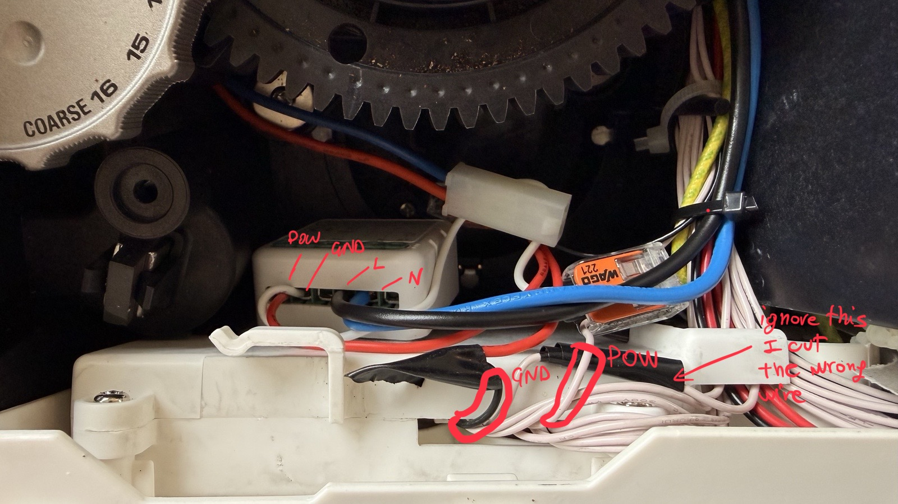
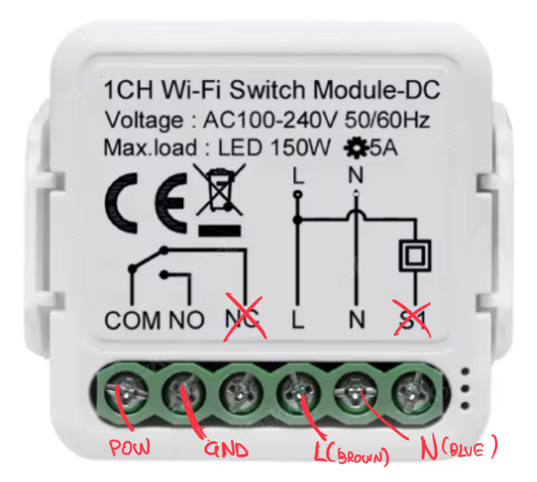
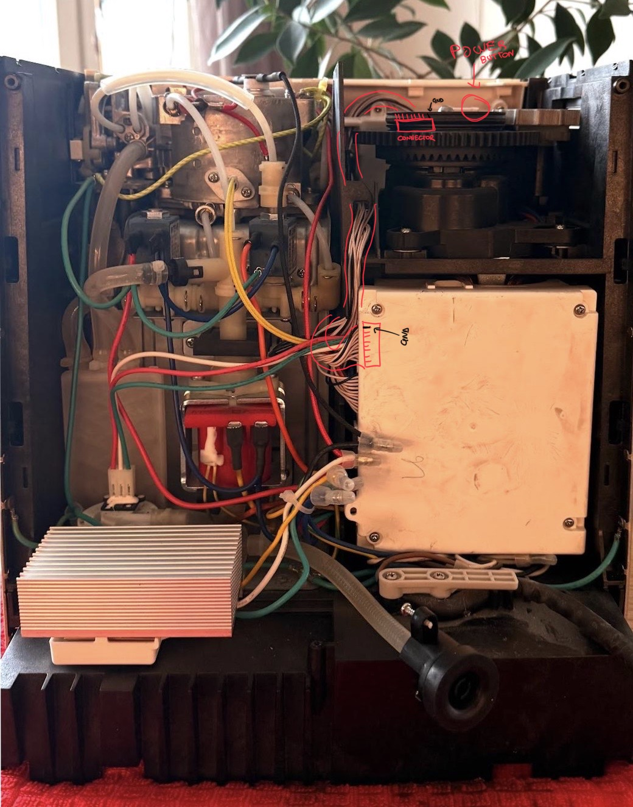
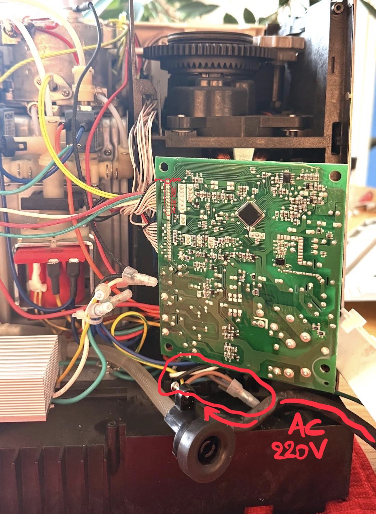
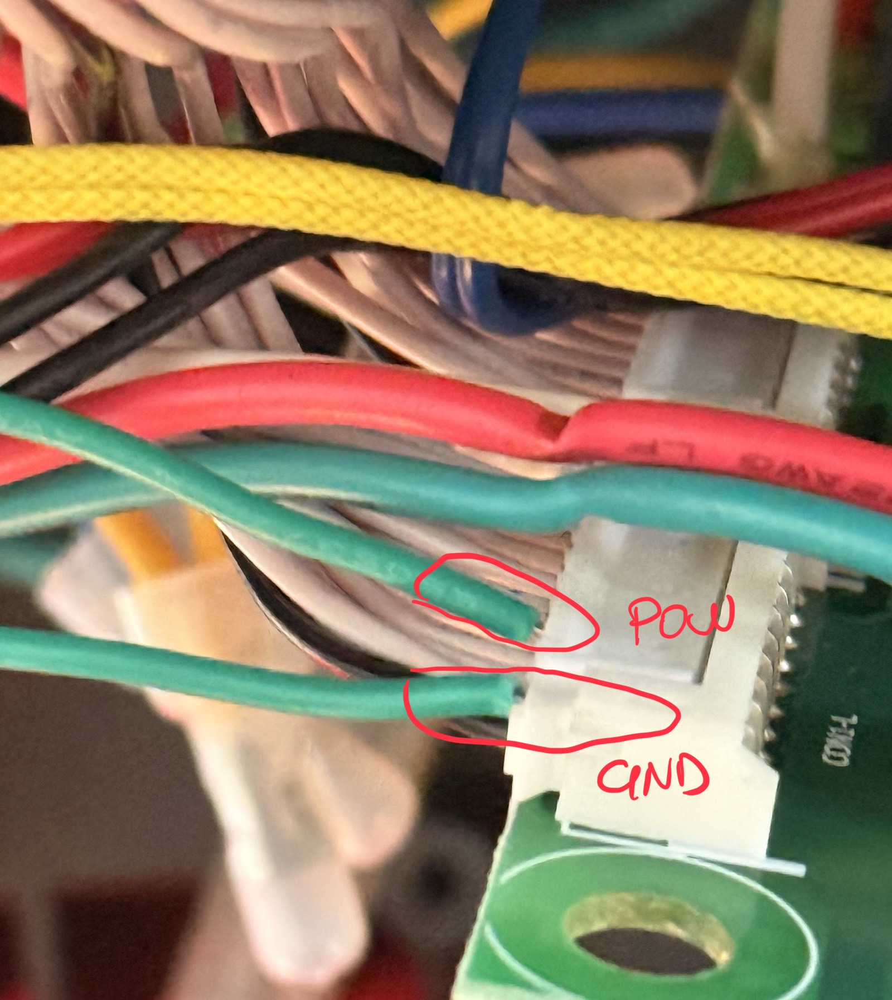
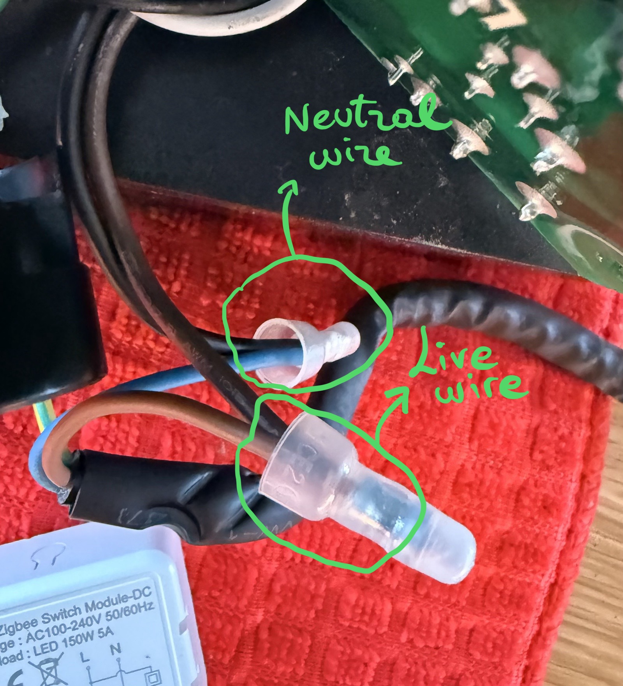
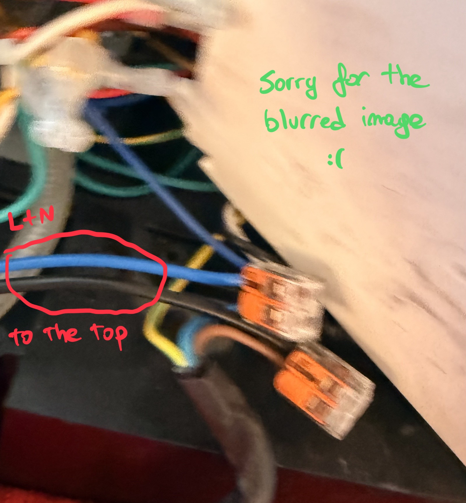
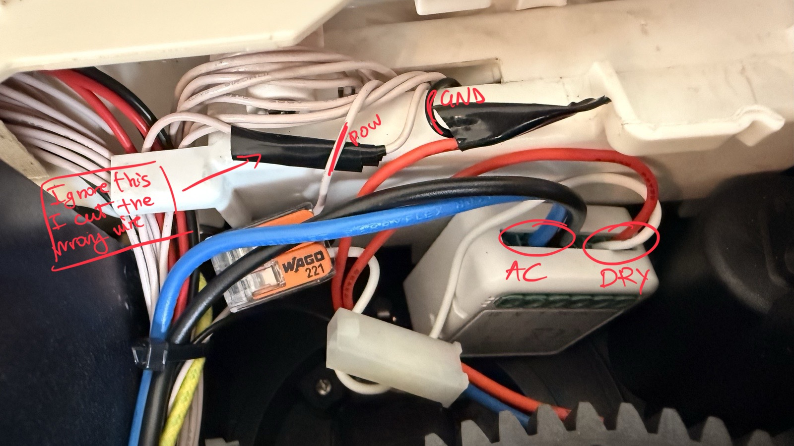
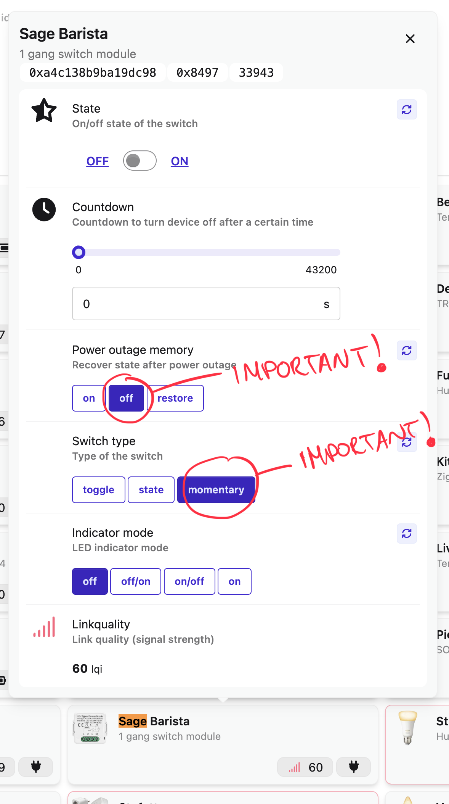

# My Sage Barista espresso machine is now smart



I wanted a simple way to have my Sage Barista already warm when I wake up.

The boiler on this machine heats up quite quickly, but the rest of the machine really needs another 15 to 20 minutes before it is properly ready. If you want a good first espresso, that extra warm-up time matters.

## Why turn it on about 20 minutes early

Sage does not give a hard `20 minute` number for the Barista Express, but the official manual is very clear about the reason: espresso quality suffers when the parts touching the coffee are still cold.

From the Sage Barista Express manual:

> "A cold portafilter and filter basket can reduce the extraction temperature enough to significantly affect the quality of your espresso."

> "A warm cup will help maintain the coffee's optimal temperature."

> "This will stabilise the temperature prior to extraction."

So the practical reason to wake the machine roughly `20 minutes` before making coffee is that the heating system may be ready quickly, while the group head, portafilter, filter basket, and surrounding metal still need time to absorb heat. That extra time makes the first shot more temperature-stable and helps avoid a sour, under-heated first espresso.

Official reference:

- Sage Barista Express instruction manual, pages 18-19 and 30: <https://www.sageappliances.com/content/dam/sage/ie/en/assets/miscellaneous/instruction-manual/espresso/BES875-instruction-manual.pdf>

The setup I ended up with is pretty simple:

- keep a Zigbee relay module permanently powered from the machine mains
- connect the relay output across the same two low-voltage wires used by the original power button
- configure the relay as a momentary switch so it behaves like a quick press

In practice, the relay does not power the machine itself. It just "presses" the original power button for me.

Before doing this, I had a much more improvised setup: a small servo taped on top of the front panel, positioned over the power button so it could physically press and release it.

It actually worked, but it was clumsy. Every now and then the tape would give up, the servo would move out of place, and the whole thing looked exactly as elegant as it sounds. That was the point where I decided I wanted to do this properly from the inside.

<video controls src="./media/pres.mov"></video>


## How it works

In plain English, this is the full chain:

- you tap a switch in Home Assistant, or in HomeKit if you expose it through Home Assistant
- Home Assistant sends the command to the Zigbee relay
- the relay briefly closes the same two contacts used by the original power button
- the coffee machine behaves exactly as if you pressed that button by hand

The relay is not switching the whole coffee machine on and off at the wall. It is just simulating a quick button press on the low-voltage control side.

Two terms matter here:

- `Momentary`: the relay closes for a short time, then opens again automatically, like a quick press and release
- `Dry Contact`: the relay behaves like an isolated switch and does not inject voltage into the coffee machine button circuit

That is why this approach is cleaner than using a smart plug. The machine still powers up through its own logic, exactly the way it was designed to.

## What you need

Before starting, this is what you need for this mod:

- a Sage Barista, or the equivalent Breville model
- a switch module that accepts `100-240V AC` input and exposes `COM` and `NO` dry-contact terminals
- a Zigbee network with a coordinator
- Home Assistant with either ZHA or Zigbee2MQTT
- a multimeter with continuity mode
- mains-rated wire
- connectors such as WAGO blocks
- zip ties or another way to secure the added wiring

In my case, the relay paired with ZHA, but I could not configure it as `momentary` there. That is one of the reasons why I migrated to Zigbee2MQTT for this setup.

## Final wiring

This is the final wiring in plain terms:

- machine mains `live` -> Zigbee module `L`
- machine mains `neutral` -> Zigbee module `N`
- power button signal wire -> Zigbee module `NO`
- board ground wire -> Zigbee module `COM`

The only important bit here is that `COM` and `NO` must behave like a dry contact. The relay should only close the original button circuit, not send power into it.

## Inspiration

This project was inspired by this Home Assistant Community thread:

<https://community.home-assistant.io/t/modifying-a-breville-sage-barista-express-coffee-machine-to-integrate-with-home-assistant/487575>

The idea is the same, but what follows is the exact process I used on my own machine.

## Hardware

I used this Tuya Zigbee relay module:

<https://www.aliexpress.com/item/1005007913776935.html?spm=a2g0o.order_list.order_list_main.89.11cb1802DIYa2W>

but you do not need this exact module.

In general, any switch module should work as long as:

- it accepts `100-240V AC` input so it can stay powered from the machine mains
- it exposes `COM` and `NO` terminals
- those `COM` and `NO` terminals behave like a dry contact




It was cheap and it worked fine for me, but I have also read reports from other people having problems with it, so I would not treat this exact model as special or required.

The only terminals that matter for this kind of mod are:

- `L` and `N` to power the module
- `COM` and `NO` to simulate the button press

From my experience, these modules are pretty simple internally: one side powers the Zigbee radio and the relay electronics, and the other side is just the relay contact itself. In other words, the module stays online all the time, and when you trigger it from Home Assistant or Zigbee2MQTT, it simply closes `COM` and `NO` for a moment, exactly like pressing a button.

That is why this works well here. We are not trying to feed power into the coffee machine logic board. We are just asking the relay to short the same two points the original button already shorts.

## Open the machine

I first removed the screws and opened the back of the machine so I could see how everything was laid out.



Then I opened the white control box to expose the main board.



This is where you will eventually identify the button wires and where the relay connection will end up.

As you can see, there are two connectors, one for each front panel section. The one I cared about was the connector for the side where the power button sits.

On my machine, the first wire had a different color and that was `GND`.

## My first attempt did not work

Before cutting anything, I tried to avoid soldering and avoid touching the original wiring too much.

I inserted a couple of wires directly into the jumper connector and fixed them in place with hot glue. In theory that sounded fine. In practice it was not reliable at all. After about two hours I had to open the machine again because the contact had come loose.

That was enough to convince me to do it properly.



## Power the Zigbee module from the machine mains

Since I wanted the relay to always be available, I powered it directly from the AC feed that enters the machine, instead of having an extra external power supply.

Inside the machine there is already a brown live wire and a blue neutral wire coming from the main cable. Those were the easiest points to tap into for the relay `L` and `N`.



I spliced into those two wires and left enough length so I could place the relay near the top of the machine. That makes future access much easier.

This is the part where you need to be careful: these are mains wires. If you do this, make sure everything is properly insulated, mechanically secure, and not routed near anything hot or moving.

*Make sure you use wire rated for mains voltage.*



I noticed too late that this photo was not great, and I really did not want to open the machine again just to retake it.

## Mount the relay

Bring these wires toward the top of the machine. To keep the build clean, use zip ties to secure them properly.

I connected the module:

- brown live wire -> `L`
- blue neutral wire -> `N`

At that point the relay stays powered all the time and is reachable from Zigbee whenever needed.

## Find the power button wire

This is the most important part of the whole mod.

You need to identify which wire becomes connected to ground when the power button is pressed. The method I used was:

1. Hold the target button down.
2. Put the multimeter in continuity mode.
3. Keep one probe on ground (which is usually the black wire coming from the connector)
4. Probe the pins on the motherboard one by one.
5. Find the pin that starts beeping, then trace that wire back to the harness so you know which wire to cut higher up


Once you find it, the rest is straightforward. But this is also the point where you need to be sure of what you are doing, because the next step is cutting into that wire.

## Break out the button wire

After identifying the correct wire, I cut it and rejoined it using a WAGO connector, adding a third branch that goes to the Zigbee relay.

That extra lead goes to `NO`.

This way, the original circuit remains intact, but the relay can also close the same contact when triggered.

## Break out ground too

I then did exactly the same thing for ground. In my machine this was the black wire shown in the photo.

I cut it, rejoined it with another WAGO connector, and added a third lead going to `COM` on the Zigbee module.

At that point the relay is sitting across the exact same two points used by the physical power button.



## Configure it correctly in Zigbee

Before closing the machine, I strongly recommend testing everything while it is still open. If something is wrong, reopening it is annoying.

The first issue I hit was the Zigbee configuration itself.

Out of the box, the module behaves like a normal on/off relay. That is not what we want here. The machine power button needs a short pulse, not a relay that stays closed.

You could solve this in Home Assistant with an automation that turns the relay back off after one second. I did not like that approach. If the automation breaks, the relay could stay closed and keep "holding" the button.

The better solution is to configure the module itself as a momentary switch, so it automatically goes back to off after each trigger.

I also made sure the module does not restore to `on` after a power outage.



Mandatory settings:

- `Switch type`: `momentary`
- `Power outage memory`: not forced to `on`

In theory this module is compatible with ZHA too, but in practice I could not get the switch to behave in momentary mode there. That was actually one of the reasons why I migrated from ZHA to Zigbee2MQTT for this setup.

With Zigbee2MQTT, configuring the switch behavior was straightforward and I could set the module to behave the way I wanted. For this specific use case, that matters more than simple pairing support. A relay that pairs but cannot be configured as momentary is not really the right tool here.

## Result

The end result is exactly what I wanted: the coffee machine can now be turned on remotely before I get to it, but the original power button still works exactly as before.

Since the relay only simulates a quick button press, the mod feels much cleaner than externally switching mains power.

## Morning automation in Home Assistant

Once the relay is exposed in Home Assistant, this can also be automated.

For example, you can warm up the machine automatically in the morning, about 20 minutes before waking up, but only if someone is home:

```yaml
alias: Warm up Sage Barista in the morning
description: ""
triggers:
  - trigger: time
    at: input_datetime.wake_up_time
conditions:
  - condition: zone
    entity_id: person.flavio
    zone: zone.home
actions:
  - action: switch.turn_on
    metadata: {}
    target:
      entity_id: switch.sage_barista
    data: {}
mode: single
```

In my case, `input_datetime.wake_up_time` represents the time when I want the machine to start warming up, not the actual alarm time.

One subtle detail is that the Zigbee module does not really know whether the coffee machine is currently on or off. It only knows that it was told to simulate a button press.

In practice, that is not a big problem. On the EU model, the machine powers itself off automatically after 30 minutes, so Home Assistant can mirror that behavior and reset the exposed switch state with another automation:

```yaml
alias: Sage Barista Momentary Switch
description: ""
triggers:
  - type: turned_on
    device_id: 8282842a6b808a83e5628093782164e7
    entity_id: 2361376bf5817f191f97086fa825313f
    domain: switch
    trigger: device
conditions: []
actions:
  - delay:
      hours: 0
      minutes: 30
      seconds: 0
      milliseconds: 0
  - action: switch.turn_off
    metadata: {}
    target:
      entity_id: switch.sage_barista
    data: {}
mode: single
```

## Things I learned

- trying to avoid cutting wires cost me more time than it saved
- leaving extra cable length for the relay placement was worth it
- identifying the right button wire is the only truly tricky step
- making the relay momentary at the device level is much safer than relying on an automation

## Safety notes

This machine contains mains voltage, heaters, pumps, and a lot of conductive metal. Treat it like mains electrical work, because that is what it is.

- unplug the machine before opening it, probing it, cutting wires, or moving the board
- verify that the relay output is actually isolated before connecting it to the button lines
- keep mains wiring insulated, secure, and away from hot or moving parts
- if you are not sure about the board ground or the relay isolation, stop there and verify before powering anything
